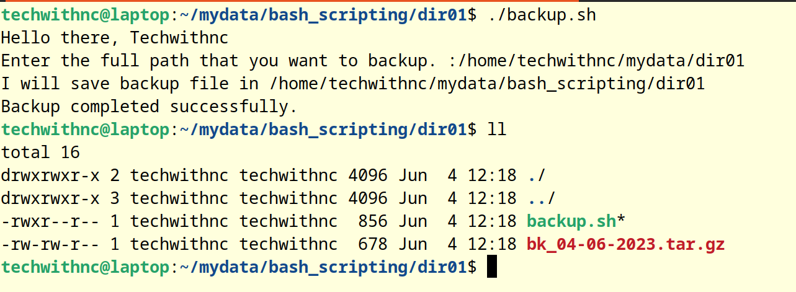
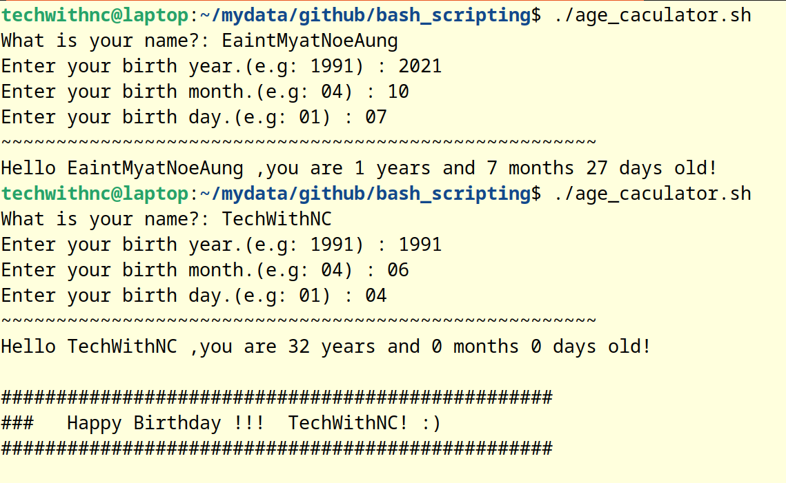

# 
 Bash Scripting 

#### Screenshot image of using directory search script.

#### Screenshot image of using file search script.

#### Screenshot image of using command search script.

#### Screenshot image of using maximum and minimum numbers finder.

#### Screenshot image of using backup script.

#### Screenshot image of using Age Calculator script.

#### Screenshot image of using Employee_info collection script.

#### Screenshot image of using Even_Odd_Checker script.

